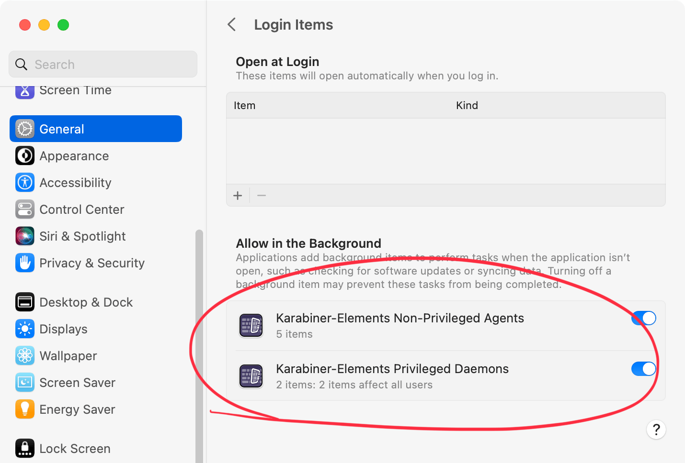
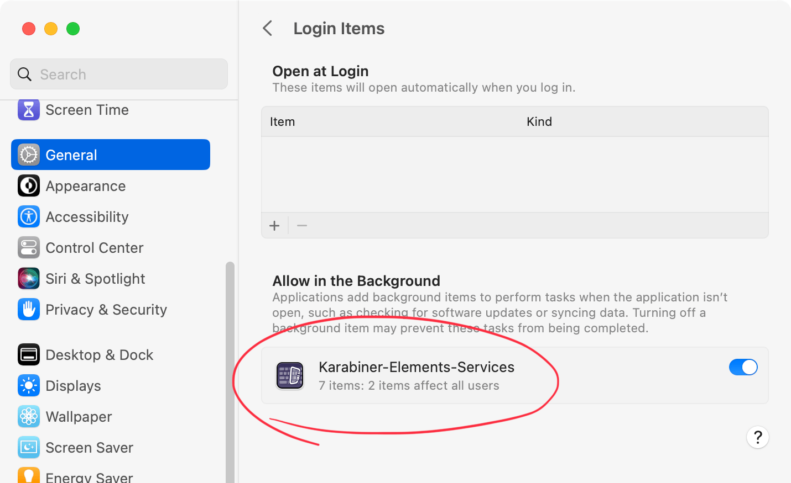

# Development

## How to replace binaries without reinstalling package

If you want to modify the source code, replacing the built binaries requires several steps.

Karabiner-Elements is split into multiple processes, and inter-process communication is performed using UNIX domain sockets.
For this communication to work, each process must have the same code signature, or be unsigned.
All binaries distributed officially are signed with G43BCU2T37, so if you replace only some of the binaries, communication will stop working.

Therefore, you first need to rebuild and install the entire package with your own signature.
The build instructions are described in `README.md`, so follow them to build and install your package.

After that, in order to replace individual binaries, you can quickly build and install them by moving to each program's directory and running `make install`.

### Replace `Karabiner-Core-Service`

```shell
cd src/core/CoreService
make install
```

### Replace `karabiner_session_monitor`

```shell
cd src/core/session_monitor
make install
```

### Replace `karabiner_console_user_server`

```shell
cd src/core/console_user_server
make install
```

## Core Processes

- `Karabiner-Core-Service (daemon)`
    - Seizes only the input devices that are configured to be modified,
      then modifies and reposts the resulting events via `Karabiner-DriverKit-VirtualHIDDevice`.
    - It is run with root privileges which are required to seize devices and send events to the virtual driver.
- `Karabiner-Core-Service (agent)`
    - Monitors application switches and changes to the focused UI element using the Accessibility API.
    - Runs with user privileges.
    - `Karabiner-Core-Service` is also granted the permissions required on the daemon side, such as Input Monitoring, when running as an agent.
      For that reason, responsibilities are split so that tasks such as launching external processes are handled by `karabiner_console_user_server` rather than by `Karabiner-Core-Service`.
- `karabiner_session_monitor`
    - It informs `Karabiner-Core-Service` of the user currently using the console.
      Karabiner-Core-Service will change the owner of the Unix domain socket that `Karabiner-Core-Service` provides for `karabiner_console_user_server`.
    - The methods for accurately detecting the console user, including when multiple people are logged in through Screen Sharing, are very limited.
      Even in macOS 14, there is no alternative to using the Core Graphics API `CGSessionCopyCurrentDictionary`.
      To use this API, it must be launched from a GUI session. Specifically, it needs to be started from LaunchAgents.
      Therefore, the function to detect the console user cannot be integrated into `Karabiner-Core-Service` and is implemented as a separate process.
    - It is run with root privileges because if the notification of the console user to `Karabiner-Core-Service` can be done by anyone, the console user could be spoofed.
      This would allow a user who is not currently using the console to send requests to `Karabiner-Core-Service` via `karabiner_console_user_server`.
- `karabiner_console_user_server`
    - `karabiner_console_user_server` connects to the Unix domain socket provided by `Karabiner-Core-Service` and requests the start of processing input events.
      `Karabiner-Core-Service` will not modify the input events until it receives a connection from `karabiner_console_user_server` (unless the system default configuration is enabled).
    - The execution of `shell_command`, `software_function`, and `select_input_source` is carried out by karabiner_console_user_server.
    - It notifies `Karabiner-Core-Service` of the information needed to reference the filter function when modifying input events, such as the active application and the current input source.
    - Run with the console user privilege.


### program sequence

#### start up

`Karabiner-Core-Service`

1.  Run `Karabiner-Core-Service`.
2.  `Karabiner-Core-Service` opens session_monitor_receiver Unix domain socket which only root can access.
3.  `Karabiner-Core-Service` opens the Unix domain socket of server.
4.  When a window server session state is changed, `Karabiner-Core-Service` changes the Unix domain socket owner to console user.

`karabiner_session_monitor`

1.  Run `karabiner_session_monitor`.
2.  `karabiner_session_monitor` monitors a window server session state and notify it to `Karabiner-Core-Service`.
3.  `Karabiner-Core-Service` changes the owner of Unix domain socket for `karabiner_console_user_server` when the console user is changed.

#### device grabbing

1.  Run `karabiner_console_user_server`.
2.  Try to open console_user_server Unix domain socket.
3.  Karabiner-Core-Service starts grabbing the input devices that should be modified.

### Other notes

IOHIDSystem requires the process is running with the console user privilege.
Thus, `Karabiner-Core-Service` cannot send events to IOHIDSystem directly.

---

## The difference of event grabbing methods

### IOKit

IOKit allows you to read raw HID input events from kernel.
The highest layer is IOHIDQueue which provides us the HID values.

`Karabiner-Core-Service` uses this method.

#### IOKit with Apple Trackpads

IOKit cannot catch events from Apple Trackpads.
(== Apple Trackpad driver does not send events to IOKit.)

Thus, we should use CGEventTap together for pointing devices.

#### `IOHIDQueueRegisterValueAvailableCallback` from multiple processes

We can use `IOHIDDeviceOpen` and `IOHIDQueueRegisterValueAvailableCallback` from multiple processes.

Generally, `ValueAvailableCallback` is not called for `IOHIDDeviceOpen(kIOHIDOptionsTypeNone)` while device is opened with `kIOHIDOptionsTypeSeizeDevice`.
However, it seems `ValueAvailableCallback` is called both seized `IOHIDDeviceRef` and normal `IOHIDDeviceRef` in some cases (e.g. after awake from sleep)

#### `IOHIDQueueRegisterValueAvailableCallback` from multiple IOHIDDeviceRef for one device

We can create multiple IOHIDDeviceRef for one device by using `IOHIDDeviceCreate`.
In this case, `ValueAvailableCallback` is called both seized `IOHIDDeviceRef` and normal `IOHIDDeviceRef`.

```c
// IOHIDDeviceRef device1 is passed by IOHIDManagerRegisterDeviceMatchingCallback
IOHIDDeviceRef device2 = IOHIDDeviceCreate(kCFAllocatorDefault, IOHIDDeviceGetService(device1));

IOHIDDeviceOpen(device1, kIOHIDOptionsTypeNone);
IOHIDDeviceOpen(device2, kIOHIDOptionsTypeSeizeDevice);

// ValueAvailableCallback is called both device1 and device2 even device2 seizes the device. (on macOS 10.13.4)
```

### CGEventTapCreate

When capturing key events with `CGEventTap`, there are several limitations.

- Events cannot be captured while Secure Event Input is enabled. This cannot be avoided even by creating a `CGEventTap` with `kCGHIDEventTap` as root.
  As a result, this causes two limitations.
    - First, event transformation cannot be performed while entering a password, for example.
    - Second, while events cannot be captured, modifier states and similar state can change, so when Secure Event Input ends, the pressed-key state may suddenly differ from what it was when Secure Event Input began. This is especially noticeable when using `sudo` in `Terminal.app`.
- With `CGEventTap`, there is no way to determine which device an event came from. Because of this, behavior such as modifying only events from the built-in keyboard cannot be implemented.
- The caps Lock hardware events cannot be received directly; instead, we receive the result after macOS has processed them.
  As a result, the key_up and key_down events for the caps Lock key do not correspond to the physical key movement:
  only key_down is received when it is locked, and only key_up is received when it is unlocked.

Because these limitations are significant, Karabiner-Elements does not use `CGEventTap` as its primary method for capturing key events.

However, `CGEventTap` is the most common event-handling mechanism provided by macOS, and it is considered less likely to be affected by OS specification changes.

For that reason, it is also possible to enable key event capture via `CGEventTap` through the `enable_cgeventtap_fallback` setting.
(When enable_cgeventtap_fallback is enabled, key events that are not handled through HID will instead be processed through CGEventTap.
In other words, key events from devices for which Modify events is disabled in Karabiner-Elements device settings will become subject to modification.
Because this has substantial side effects, enable_cgeventtap_fallback is off by default.)

---

## The difference of event posting methods

### IOKit device report in dext

It requires posting HID events.

The IOHIKeyboard processes the reports by passing reports to `handleReport`.
`Karabiner-Core-Service` uses this method by using `Karabiner-DriverKit-VirtualHIDDevice`.

Note: `handleReport` fails to treat events which usage page are `kHIDPage_AppleVendorKeyboard` or `kHIDPage_AppleVendorTopCase` on macOS 10.11 or earlier.

### IOHIDPostEvent

It requires posting coregraphics events.

`IOHIDPostEvent` will be failed if the process is not running in the current session user.
(The root user is also forbidden.)

### CGEventPost

It requires posting coregraphics events.

There are several limitations for events sent via `CGEventPost`.
The biggest limitation is that the behavior of the `fn` key sent via `CGEventPost` differs from that of the physical `fn` key.

- When `fn` is pressed by itself, the function configured in macOS System Settings under `Press 🌐 key to` is not triggered.
- Actions such as moving a window with `fn+control+arrow keys` do not work.

Thus, `Karabiner-Core-Service` does not use `CGEventPost`.

---

## Modifier flags handling in kernel

The modifier flag events are handled in the following sequence in macOS 10.12.

1.  Receive HID reports from device.
2.  Treat reports in the keyboard device driver.
3.  Treat flags in accessibility functions. (eg. sticky keys, zoom)
4.  Treat flags in mouse events.
5.  Treat flags in IOHIDSystem.
6.  Treat flags in Coregraphics.

Thus, `IOHIDPostEvent` will be ignored in accessibility functions and mouse events.

---

## About hid reports

We can get hid reports from devices via `IOHIDDeviceRegisterInputReportCallback`.
The hid report contains a list of pressed keys, so it seems suitable information to observe.

But `Karabiner-Core-Service` does not use it in order to reduce the device dependancy.

### The limitation of device reports

#### Apple devices reports

Apple keyboards does not use generic HID keyboard report descriptor.
Thus, we have to handle them by separate way.

##### Generic HID keyboard report descriptor

```c
uint8_t modifiers;
uint8_t reserved;
uint8_t keys[6];
```

###### modifiers bit

```text
0x1 << 0 : left control
0x1 << 1 : left shift
0x1 << 2 : left option
0x1 << 3 : left command
0x1 << 4 : right control
0x1 << 5 : right shift
0x1 << 6 : right option
0x1 << 7 : right command
```

##### Apple HID keyboard report descriptor

```c
uint8_t record_id;
uint8_t modifiers;
uint8_t reserved;
uint8_t keys[6];
uint8_t extra_modifiers; // fn
```

---

## Session

### About console user detection

There are several way to get the session information, however, the reliable way is limited.

- The owner of `/dev/console`
    - The owner of `/dev/console` becomes wrong value after remote user is logged in via Screen Sharing.
      How to reproduce the problem.
        1.  Restart macOS.
        2.  Log in from console as Guest user.
        3.  Log in from Screen Sharing as another user.
        4.  The owner of `/dev/console` is changed to another user even the console user is Guest.
- `SCDynamicStoreCopyConsoleUser`
    - `SCDynamicStoreCopyConsoleUser` has same problem of `/dev/console`.
- `SessionGetInfo`
    - `SessionGetInfo` cannot get uid of session.
      Thus, `SessionGetInfo` cannot determine the console user.
- `CGSessionCopyCurrentDictionary`
    - `karabiner_session_monitor` uses it to avoid the above problems.

---

## Caps lock handling

The caps lock is quite different from the normal modifier.

- The caps lock might be used another purpose. (e.g., switch input source)
    - We should refer the caps lock LED to determine caps lock is on/off.
- The caps lock modifier is not synchronized with the physical state of key down/up.
    - We should send key_down and key_up event to change the caps lock state.
- The caps lock will be treated as both generic key event and modifier key event due to the above reasons.
    - If the caps lock is specified as "to.key_code: caps_lock", the caps lock event is treated as generic key event.
        - For example, `key_event_dispatcher` manages in `key_event_dispatcher::pressed_keys_`.
    - If the caps lock is specified as "from.modifiers" or "to.modifiers", the caps lock event is treated as modifier key event.
        - For example, `key_event_dispatcher` manages in `key_event_dispatcher::pressed_modifier_flags_`.

### Events related with caps lock in Karabiner-Elements

- `hid::usage::keyboard_or_keypad::keyboard_caps_lock`
    - The event is sent when the physical caps lock key is pressed.
    - The event does not change the state of `modifier_flag_manager` because the event might be used another purpose.
    - `event::type::caps_lock_state_changed` might be sent due to the LED state change.
- `event::type::caps_lock_state_changed`
    - This event happens when the caps lock LED is changed.
    - The event changes the state of `modifier_flag_manager`.
        - `hid::usage::keyboard_or_keypad::keyboard_caps_lock` might be sent due to the `modifier_flag_manager` state change.
- `event::type::sticky_modifier`
    - `basic > from.modifiers.mandatory` and `basic > to.modifiers` also send this event in order to change the state of `modifier_flag_manager`,
    - The event changes the state of `modifier_flag_manager`.
        - `hid::usage::keyboard_or_keypad::keyboard_caps_lock` might be sent due to the `modifier_flag_manager` state change.

### The flow of updating `modifier_flag_manager`

- Karabiner-Core-Service receives `hid::usage::keyboard_or_keypad::keyboard_caps_lock`.
- Send the event via virtual hid keyboard.
- macOS update the caps lock LED of virtual hid keyboard.
- Virtual hid keyboard sends the LED updated event.
- Karabiner-Core-Service observes events from the virtual hid keyboard.
  When an event {usage_page::leds, usage::led::caps_lock} is detected,
  Karabiner-Core-Service generates an `event::type::caps_lock_state_changed` and adds it to the queue.
- The state of `modifier_flag_manager` is changed by `event::type::caps_lock_state_changed`.

### modifier state holders

- `modifier_flag_manager`
    - Keep ideal modifiers state for event modification.
- `key_event_dispatcher`
    - Keep actually sent modifiers.

For example, `modifier_flag_manager` contains the lazy modifiers, but `key_event_dispatcher` does not.

### The flow of handling caps lock as modifier

Example:

```json
{
    "from": {
        "key_code": "down_arrow",
        "modifiers": {
            "mandatory": ["caps_lock"],
            "optional": ["any"]
        }
    },
    "to": [
        {
            "key_code": "d"
        }
    ],
    "type": "basic"
}
```

- Press the physical caps_lock key (`hid::usage::keyboard_or_keypad::keyboard_caps_lock`)
    - `key_event_dispatcher` is updated.
        - `pressed_keys_.insert(caps_lock)`
    - macOS update the caps lock LED state (on).
    - `event::type::caps_lock_state_changed (on)` is sent via `krbn::event_queue::utility::make_queue` in `Karabiner-Core-Service`.
        - `modifier_flag_manager increase_led_lock (caps_lock)`
        - `key_event_dispatcher` is updated.
            - `pressed_modifier_flags_.insert(caps_lock)`
- Release the physical caps_lock key (`hid::usage::keyboard_or_keypad::keyboard_caps_lock`)
    - `key_event_dispatcher` is updated.
        - `pressed_keys_.erase(caps_lock)`
- Press `down_arrow` key.j
    - `sticky_modifier caps_lock false` is sent by `modifiers.mandatory`.
        - `modifier_flag_manager decrease_sticky (caps_lock)`
    - `hid::usage::keyboard_or_keypad::keyboard_caps_lock` is sent via virtual hid keyboard.
    - `key_event_dispatcher` is updated.
        - `pressed_modifier_flags_.erase(caps_lock)`
    - `d` is sent via virtual hid keyboard.
    - sticky_modifiers are erased.
    - `sticky_modifier caps_lock true` is sent by `modifiers.mandatory`.
        - `modifier_flag_manager increase_sticky (caps_lock)`
    - macOS update the caps lock LED state (off).
    - `event::type::caps_lock_state_changed (off)` is sent via `krbn::event_queue::utility::make_queue` in `Karabiner-Core-Service`.
        - `modifier_flag_manager decrease_led_lock (caps_lock)`
            - Note: led_lock will be ignored while other counter is active in modifier_flag_manager.
- Release `down_arrow` key.
    - `d` is sent via virtual hid keyboard.
- Press `tab` key.
    - `hid::usage::keyboard_or_keypad::keyboard_caps_lock` is sent via virtual hid keyboard by sticky_modifier.
    - sticky_modifiers are erased.
    - `tab` is sent via virtual hid keyboard.

---

## Permissions

`Karabiner-Elements` requires several permissions from the user in order to operate.

- Privileged Daemon (SMAppService.daemon)
    - This permission is required to run `Karabiner-Core-Service` with root privileges.
    - Root privileges are necessary because `kIOHIDOptionsTypeSeizeDevice` is used to seize devices when opening them.
- Input Monitoring
    - Required to receive events from devices via `IOHIDDeviceOpen`.
- Accessibility
    - This permission is required for the following three purposes:
        - Detecting application switches for apps that do not emit `NSWorkspace.didActivateApplicationNotification` notifications, such as Spotlight.
        - Obtaining the focused UI element.
        - Receiving key events when the CGEventTap fallback is enabled.

---

## CGEventTap fallback behavior

The following describes the behavior when the CGEventTap fallback is enabled via `enable_cgeventtap_fallback`.

Even when the CGEventTap fallback is enabled, devices that can be handled through `IOHIDDeviceOpen` are still processed through that path in preference to `CGEventTap`.
Therefore, only devices that meet one of the following conditions are handled via `CGEventTap`:

- Devices for which `IOHIDDeviceOpen` fails for some reason.
- Devices for which `Modify events` is turned off.
  (This is not a typo. Since `CGEventTap` doesn't provide a way to determine the source device of an event, all events received through `CGEventTap` must be processed.
  This means it is not possible to enable or disable processing on a per-device basis.)

### Avoid processing events sent via the virtual device in CGEventTap

As described above, `CGEventPost` has several limitations.
For that reason, even when device events are captured via the CGEventTap fallback, the processed key events are still sent through the virtual device.
(In addition, events processed through HID are also sent via the virtual device.)

The event flow is therefore as follows:

- Capture key events using `CGEventTap`.
- Modify them through the manipulator pipeline.
- Send the modified events to the virtual device.
- Since events sent via the virtual device re-enter through `CGEventTap`, ignore events that have already been sent.

The most challenging part is filtering out re-entrant events.
`CGEventTap` does not provide reliable information about which device generated an event, so there is no stable way to detect events originating from the virtual device. (`kCGEventSourceUnixProcessID` and `kCGEventSourceUserData` both become `0` after passing through the virtual device.)

To work around this, we keep track of the events sent to the virtual device and ignore matching events when they reappear.

In theory, using `CGEventCreateKeyboardEvent` would simplify this, since re-entrant events could be identified and ignored via `kCGEventSourceUnixProcessID`.
However, key events generated with `CGEventCreateKeyboardEvent` and posted via `CGEventPost` have behavioral limitations. For example, `fn` key events are not treated by macOS in the same way as true hardware `fn` key presses for certain system-level behaviors, such as tapping `fn` by itself or using `fn+control+arrow keys` for window tiling.

Because of this, using a virtual device is still necessary in order to generate key events that behave naturally.

### Handling internal state before and after Secure Event Input

Another challenge with CGEventTap is how it behaves when Secure Event Input is enabled, for example while entering a password.
In this state, no events are delivered to CGEventTap.
While this is correct from a security perspective, it complicates things for software that relies on CGEventTap.

Because events are suppressed during Secure Event Input, once it is disabled,
the internal state of modifiers and pressed keys can suddenly become inconsistent.
To avoid this, key states must be reset properly when Secure Event Input is enabled and disabled;
otherwise, keys may be incorrectly treated as still being pressed.

There is also a related issue: if Secure Event Input becomes active while a key is being held down, the corresponding key_up event is never observed.
This can result in unintended key repeats.
This can be easily reproduced by running a command such as sudo ls in Terminal.

To mitigate this, all currently pressed keys must be forcibly released by emitting key_up events when Secure Event Input is detected.

---

## macOS Service Management

The elements related to managing services on macOS are as follows:

- `SMAppService`:
    - Register `LaunchDaemons/*.plist` and `LaunchAgents/*.plist`.
- `launchd`:
    - Starts processes according to the contents of plist files.
- `sfltool`:
    - A command to reset approval settings for LaunchDaemons.

There are two types of background processes: `daemon` and `agent`. Their characteristics are as follows:

- `daemon`:
    - Runs with root privileges.
    - Executes with the startup of macOS, even before the user logs in.
    - After the plist is registered by `SMAppService`, it is executed only after being approved by the user from `System Settings > General > Login Items & Extensions`.
- `agent`:
    - Runs with user privileges.
    - Executes when the user logs in.
    - Executes as soon as the plist is registered by `SMAppService`.

The behavior of agents is straightforward, and they operate as expected.
However, daemons require user approval, which can easily lead to configuration inconsistencies on macOS.
Specifically, the following issues occur on macOS 13:

- The daemon does not automatically start after user approval if the following steps are taken:
    - Reproduction steps:
        1.  Register a daemon using `SMAppService.register`.
        2.  Approve the daemon in System Settings > General > Login Items & Extensions.
        3.  Revoke the approval.
        4.  Restart macOS.
        5.  Re-approve the daemon.
    - Workaround:
        - After re-approving the daemon, register it using `SMAppService.register` to start the daemon.
        - Alternatively, restarting macOS also resolves the issue.
- The following steps can lead to various issues:
    - Reproduction steps:
        1.  Register a daemon using `SMAppService.register`.
        2.  Approve the daemon in System Settings > General > Login Items & Extensions.
        3.  Reset the Login Items settings with `sfltool resetbtm`.
        4.  Restart macOS.
        5.  Register the daemon with SMAppService.register.
            - Problem #1: Although the user has not approved the daemon, it appears as if it is approved in System Settings > General > Login Items & Extensions.
              The status of SMAppService correctly shows requiresApproval.
              This is a problem with the System Settings UI.
            - Problem #2: In this state, even if the user re-approves the daemon, it will not start.
              Restarting macOS will not start the daemon either.
              To get it running, you need to call `SMAppService.unregister` once before `SMAppService.register`.

To avoid these issues, the application should adhere to the following:

- To avoid an issue after `sfltool resetbtm`, if the status of SMAppService is `.notFound`, call `unregister` before calling `register`.
- To avoid an issue of the daemon not starting, periodically check if the daemon is running.
  If the process is not running, call `SMAppService.register` to start the daemon.
- To avoid an issue with the System Settings UI, prompt the user to approve the daemon if it is not running.
  Inform them that it may already appear as approved and, if it does not work correctly, guide them to revoke and re-approve the daemon.

### Separate the applications that manage daemons and agents

As mentioned above, daemons and agents have different approval statuses when registered.
In the macOS System Settings > General > Login Items & Extensions UI, a display issue occurs if these two services are managed by a single application.
Specifically, if either daemons or agents are in the `requiresApproval` state, the checkbox in Login Items should be off.
However, in reality, if either one is in the `enabled` state, the checkbox appears on.
This results in the checkbox being on even though either daemons or agents are not actually enabled.

Separating the applications that manage daemons and agents can avoid this issue.
Additionally, by thoughtfully naming the management applications, it becomes clearer that privileged processes are running, which enhances the user experience.
Therefore, separating them is preferable from a user experience perspective.

| Good example                                                | Bad example                                                   |
| ----------------------------------------------------------- | ------------------------------------------------------------- |
|  |  |

### How to check if a process is running using `launchctl print`

First, run the following command:

```shell
launchctl print system/org.pqrs.service.daemon.Karabiner-Core-Service
```

If the output includes a line like `pid = 658`, this indicates the process ID, and the daemon is running if such a line is present.
