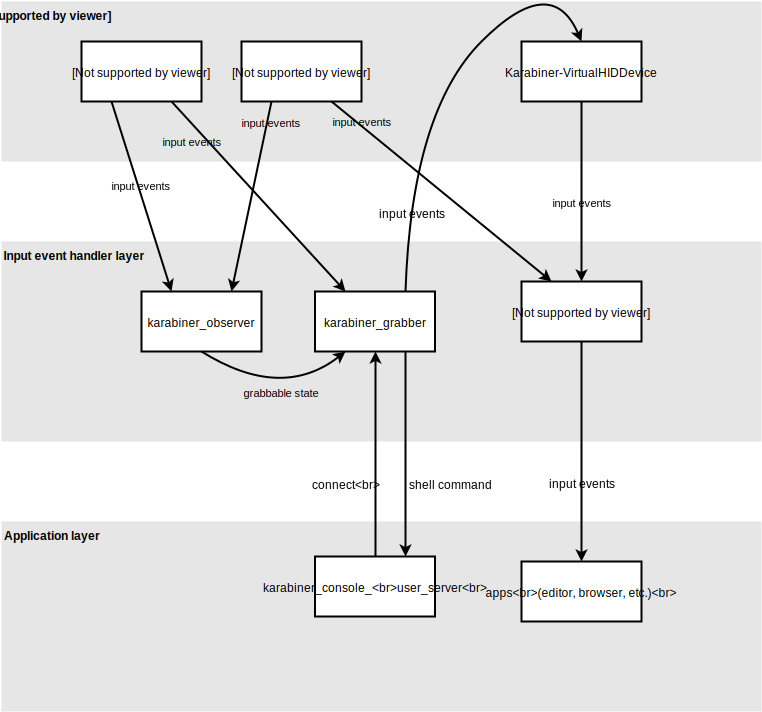

# Development

## How to replace binaries without reinstalling package

### Replace `karabiner_grabber`

```shell
cd src/core/grabber
make install
```

### Replace `karabiner_observer`

```shell
cd src/core/observer
make install
```

### Replace `karabiner_session_monitor`

```shell
cd src/core/session_monitor
make install
```

### Replace `karabiner_console_user_server`

```shell
cd src/core/console_user_server
make install
```

## Core Processes

- `karabiner_grabber`
  - Run with root privilege.
  - Seize the input devices and modify events then post events using `Karabiner-VirtualHIDDevice`.
- `karabiner_observer`
  - Run with root privilege.
  - Observe input devices and manage the grabbable state.
  - Tell the grabbable state to `karabiner_grabber`.
- `karabiner_session_monitor`
  - Run with root privilege.
  - (Opened by console user privilege in order to use CoreGraphics session API.
    And then, effective uid is changed to root by SUID in order to communicate a secure Unix domain socket of `karabiner_grabber`.)
  - Monitor a window server session state and notify it to `karabiner_grabber`.
- `karabiner_console_user_server`
  - Run with console user privilege.
  - Monitor system preferences values (key repeat, etc) and notify them to `karabiner_grabber`.
  - Execute shell commands which are specified by `shell_command` in `complex_modifications`.
  - `karabiner_grabber` seizes devices only when `karabiner_console_user_server` is running.



### program sequence

#### start up

`karabiner_grabber`

1.  Run `karabiner_grabber`.
2.  `karabiner_grabber` opens session_monitor_receiver Unix domain socket which only root can access.
3.  `karabiner_grabber` opens grabber server Unix domain socket.
4.  When a window server session state is changed, `karabiner_grabber` changes the Unix domain socket owner to console user.

`karabiner_observer`

1.  Run `karabiner_observer`.
2.  `karabiner_observer` observes devices and send the input events to `karabiner_grabber`.

`karabiner_session_monitor`

1.  Run `karabiner_session_monitor`.
2.  `karabiner_session_monitor` monitors a window server session state and notify it to `karabiner_grabber`.
3.  `karabiner_grabber` changes the owner of Unix domain socket for `karabiner_console_user_server` when the console user is changed.

#### device grabbing

1.  Run `karabiner_console_user_server`.
2.  Try to open console_user_server Unix domain socket.
3.  grabber seizes input devices.

### Other notes

IOHIDSystem requires the process is running with the console user privilege.
Thus, `karabiner_grabber` cannot send events to IOHIDSystem directly.

---

## The difference of event grabbing methods

### IOKit

IOKit allows you to read raw HID input events from kernel.<br />
The highest layer is IOHIDQueue which provides us the HID values.

`karabiner_grabber` uses this method.

#### IOKit with Apple Trackpads

IOKit cannot catch events from Apple Trackpads.<br />
(== Apple Trackpad driver does not send events to IOKit.)

Thus, we should use CGEventTap together for pointing devices.

#### `IOHIDQueueRegisterValueAvailableCallback` from multiple processes

We can use `IOHIDDeviceOpen` and `IOHIDQueueRegisterValueAvailableCallback` from multiple processes.

Generally, `ValueAvailableCallback` is not called for `IOHIDDeviceOpen(kIOHIDOptionsTypeNone)` while device is opened with `kIOHIDOptionsTypeSeizeDevice`.
However, it seems `ValueAvailableCallback` is called both seized `IOHIDDeviceRef` and normal `IOHIDDeviceRef` in some cases (e.g. after awake from sleep)

#### `IOHIDQueueRegisterValueAvailableCallback` from multiple IOHIDDeviceRef for one device

We can create multiple IOHIDDeviceRef for one device by using `IOHIDDeviceCreate`.
In this case, `ValueAvailableCallback` is called both seized `IOHIDDeviceRef` and normal `IOHIDDeviceRef`.

```c
// IOHIDDeviceRef device1 is passed by IOHIDManagerRegisterDeviceMatchingCallback
IOHIDDeviceRef device2 = IOHIDDeviceCreate(kCFAllocatorDefault, IOHIDDeviceGetService(device1));

IOHIDDeviceOpen(device1, kIOHIDOptionsTypeNone);
IOHIDDeviceOpen(device2, kIOHIDOptionsTypeSeizeDevice);

// ValueAvailableCallback is called both device1 and device2 even device2 seizes the device. (on macOS 10.13.4)
```

### CGEventTapCreate

`CGEventTapCreate` is a limited approach.<br />
It does not work with Secure Keyboard Entry even if we use `kCGHIDEventTap` and root privillege.<br />
Thus, it does not work in Terminal.<br />
You can confirm this behavior in `appendix/eventtap`.

There is another problem with `CGEventTapCreate`.<br />
`Shake mouse pointer to locate` feature will be stopped after we call `CGEventTapCreate` with `kCGEventTapOptionDefault`.<br />
(We confirmed the problem at least on macOS 10.13.1.)<br />

`karabiner_grabber` uses `CGEventTapCreate` with `kCGEventTapOptionListenOnly` in order to catch Apple mouse/trackpad events which we cannot catch in IOKit.
(See above note.)

---

## The difference of event posting methods

### IOKit device report in kext

It requires posting HID events.<br />
The IOHIKeyboard processes the reports by passing reports to `handleReport`.

`karabiner_grabber` uses this method by using `Karabiner-VirtualHIDDevice`.

Note: `handleReport` fails to treat events which usage page are `kHIDPage_AppleVendorKeyboard` or `kHIDPage_AppleVendorTopCase` on macOS 10.11 or earlier.

### IOKit call IOHIKeyboard::dispatchKeyboardEvent in kext

It requires posting HID usage page and usage.

Caution: IOHIDValue observers cannot receive events that are posted via `dispatchKeyboardEvent`.

### IOHIDPostEvent

It requires posting coregraphics events.<br />

`IOHIDPostEvent` will be failed if the process is not running in the current session user.
(The root user is also forbidden.)

### CGEventPost

It requires posting coregraphics events.<br />

`CGEventPost` does not support some key events in OS X 10.12.

- Mission Control key
- Launchpad key
- Option-Command-Escape

Thus, `karabiner_grabber` does not use `CGEventPost`.

### IOKit device value in kext

It requires posting HID events.<br />
We have to make a complete set of virtual devices to post the IOHIDValue.

---

## Modifier flags handling in kernel

The modifier flag events are handled in the following sequence in macOS 10.12.

1.  Receive HID reports from device.
2.  Treat reports in the keyboard device driver.
3.  Treat flags in accessibility functions. (eg. sticky keys, zoom)
4.  Treat flags in mouse events.
5.  Treat flags in IOHIDSystem.
6.  Treat flags in Coregraphics.

Thus, `IOHIDPostEvent` will be ignored in accessibility functions and mouse events.

---

## About hid reports

We can get hid reports from devices via `IOHIDDeviceRegisterInputReportCallback`.<br />
The hid report contains a list of pressed keys, so it seems suitable information to observe.

But `karabiner_grabber` does not use it in order to reduce the device dependancy.

### The limitation of device reports

#### Apple devices reports

Apple keyboards does not use generic HID keyboard report descriptor.<br />
Thus, we have to handle them by separate way.

##### Generic HID keyboard report descriptor

```c
uint8_t modifiers;
uint8_t reserved;
uint8_t keys[6];
```

###### modifiers bit

```text
0x1 << 0 : left control
0x1 << 1 : left shift
0x1 << 2 : left option
0x1 << 3 : left command
0x1 << 4 : right control
0x1 << 5 : right shift
0x1 << 6 : right option
0x1 << 7 : right command
```

##### Apple HID keyboard report descriptor

```c
uint8_t record_id;
uint8_t modifiers;
uint8_t reserved;
uint8_t keys[6];
uint8_t extra_modifiers; // fn
```

---

## Session

### About console user detection

There are several way to get the session information, however, the reliable way is limited.

- The owner of `/dev/console`
  - The owner of `/dev/console` becomes wrong value after remote user is logged in via Screen Sharing.<br />
    How to reproduce the problem.
    1.  Restart macOS.
    2.  Log in from console as Guest user.
    3.  Log in from Screen Sharing as another user.
    4.  The owner of `/dev/console` is changed to another user even the console user is Guest.
- `SCDynamicStoreCopyConsoleUser`
  - `SCDynamicStoreCopyConsoleUser` has same problem of `/dev/console`.
- `SessionGetInfo`
  - `SessionGetInfo` cannot get uid of session.
    Thus, `SessionGetInfo` cannot determine the console user.
- `CGSessionCopyCurrentDictionary`
  - `karabiner_session_monitor` uses it to avoid the above problems.

---

## Kernel extensions location

There is a macOS problem that macOS load old kext from cache after we update a kext file in /Library/Extensions.
(It seems macOS failed to update kext cache.)

Thus, Karabiner-VirtualHIDDevice adds the version number to the kext directory name and put kext file into `/Library/Application Support` where is described TN2459.
<https://developer.apple.com/library/content/technotes/tn2459/_index.html>
