* [Installation](#installation)
* [Open Karabiner-Elements](#open-karabiner-elements)
* [Quit Karabiner-Elements](#quit-karabiner-elements)
* [Uninstall Karabiner-Elements](#uninstall-karabiner-elements)
* [How to configure Karabiner-Elements](#how-to-configure-karabiner-elements)
* [Set keyboard type](#set-keyboard-type)

# Installation

1. Download the Karabiner-Elements package from [here](https://pqrs.org/latest/karabiner-elements-latest.dmg).
2. Open the dmg file and then open the installer.
3. Karabiner-Elements and Karabiner-EventViewer will be installed into Launchpad.

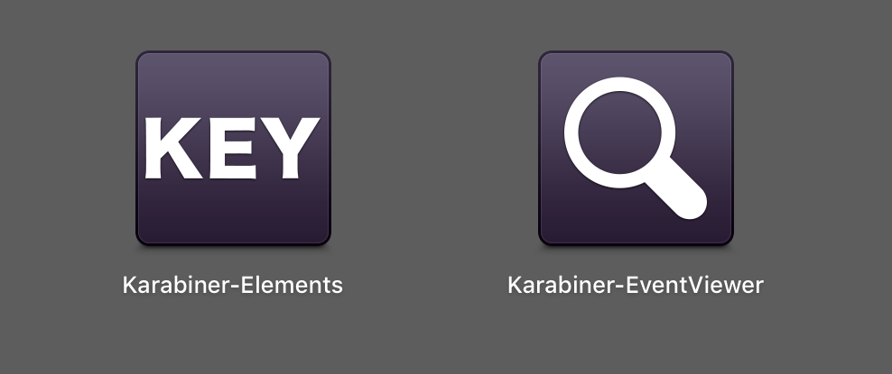

# Open Karabiner-Elements

Open Karabiner-Elements from Launchpad. The preferences window will be opened.

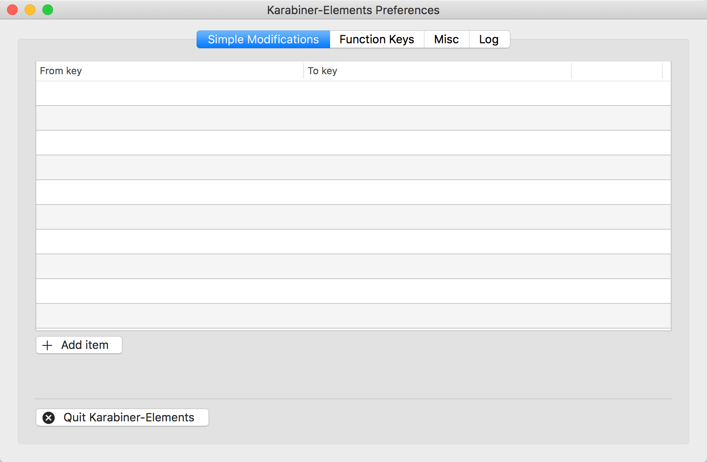

# Quit Karabiner-Elements

You can quit Karabiner-Elements by pressing the "Quit Karabiner-Elements" button in the preferences window.

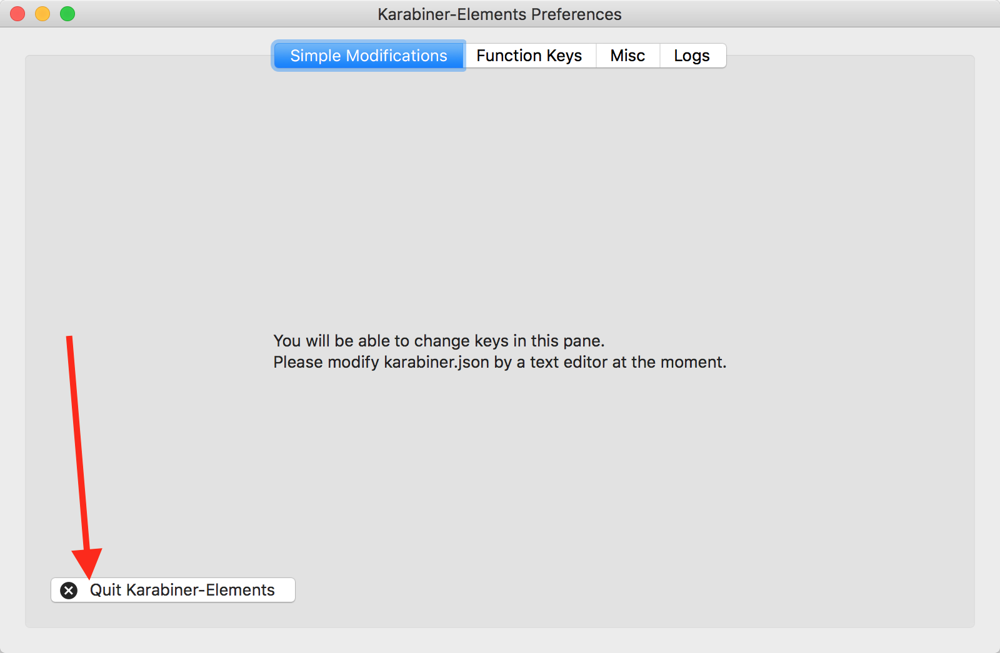

# Uninstall Karabiner-Elements

You can uninstall Karabiner-Elements from Misc tab.

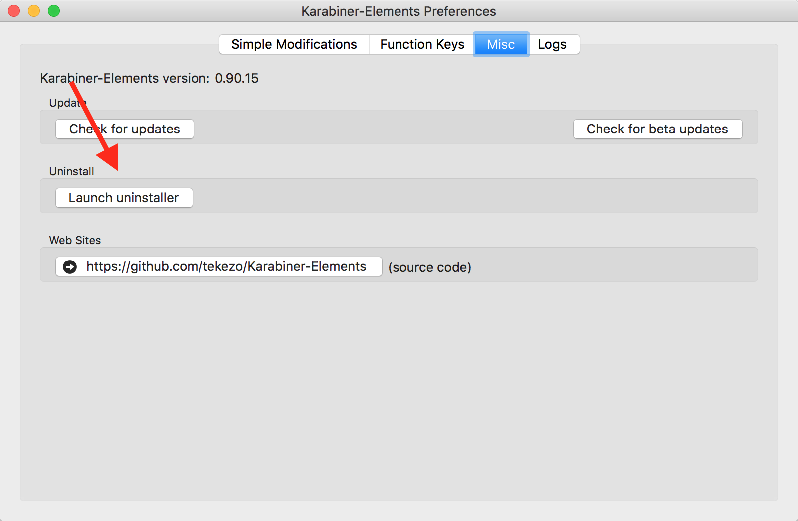

# How to configure Karabiner-Elements

You can add key modification configurations from Preferences.

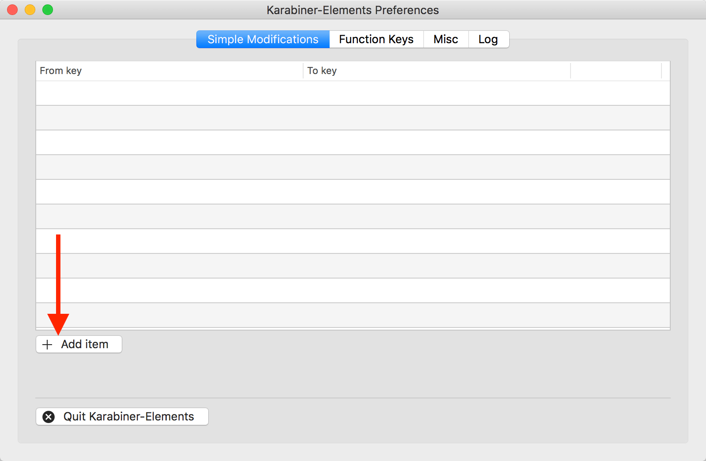

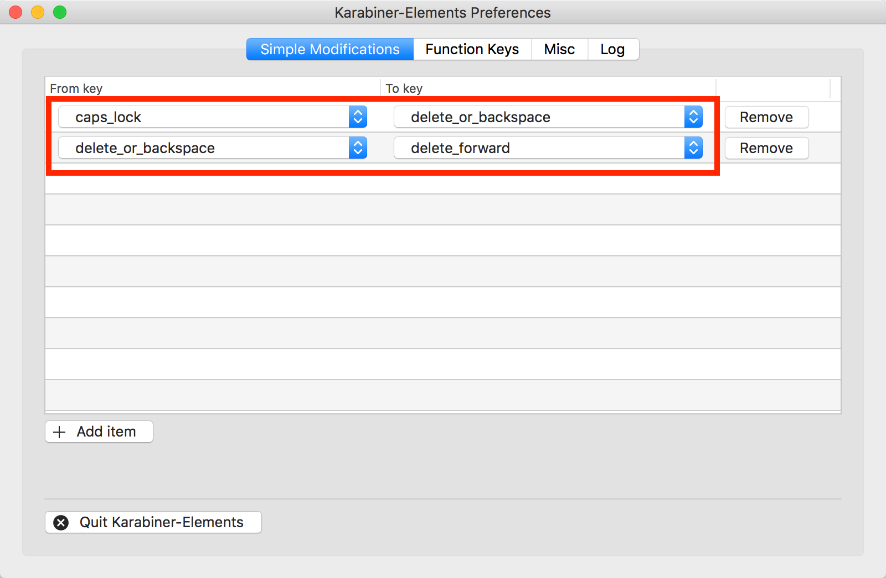

You can investigate the key name in Karabiner-EventViewer.

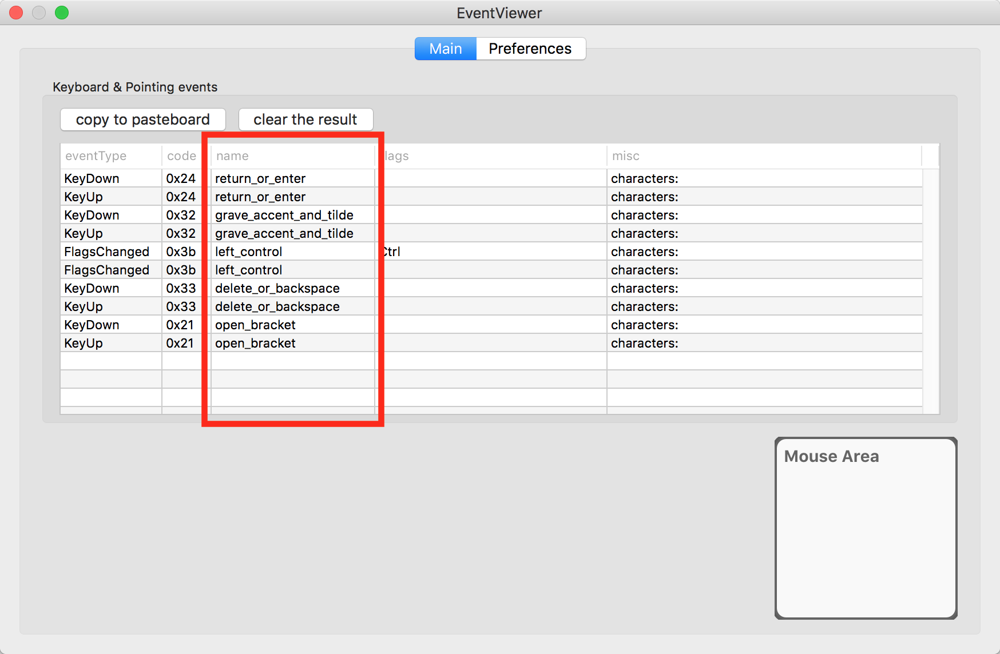

# Set keyboard type

You can set keyboard type in Virtual Keyboard tab.

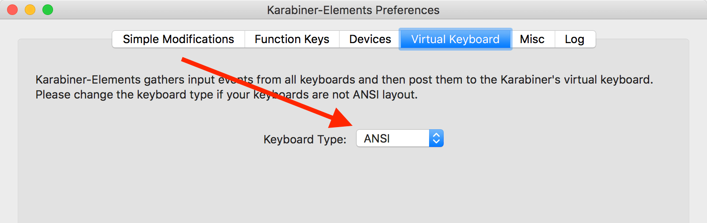

oIf your keyboard is not ANSI layout, you have to set the keyboard type of virtual keyboard.

# Learn about `karabiner.json`

Karabiner-Elements configuration will be saved to `~/.karabiner.d/configuration/karabiner.json`.

You don't need to care about this file for normal usage.
We describe about `karabiner.json` for advanced usage.

## An example `karabiner.json`

`karabiner.json` uses the `json` syntax. If you are not familiar with it, it may help to [read up on it](http://www.w3schools.com/js/js_json_intro.asp) beforehand.

The following is an example configuration. It maps Caps Lock `⇪` key to Delete `⌫` key.

```json
{
    "profiles": [
        {
            "name": "Default profile",
            "selected": true,
            "simple_modifications": {
                "caps_lock": "delete_or_backspace"
            }
        }
    ]
}
```

All mapping rules must be placed between `"simple_modifications": {` and `}`. Rules are separated by a comma.

Let's say, in addition to Caps Lock mapping, we want to map left Command `⌘` key to Control `⌃` key. To do this, we can add new rule under the `caps_lock` rule.

```json
{
    "profiles": [
        {
            "name": "Default profile",
            "selected": true,
            "simple_modifications": {
                "caps_lock": "delete_or_backspace",
                "left_command": "left_control"
            }
        }
    ]
}
```

## The key definition

You need key definitions to map keys. For example you should know Caps Lock `⇪` key is `caps_lock`. Keys (e.g. "caps_lock") are defined in [`simple_modifications.json`](https://github.com/tekezo/Karabiner-Elements/blob/master/src/apps/PreferencesWindow/PreferencesWindow/Resources/simple_modifications.json).

## Typical configuration files

Following are few configuration files that will help you get started. You can use them as-is or mix the rules as per your need.

* [Change caps lock to delete](https://github.com/tekezo/Karabiner-Elements/blob/master/examples/change_caps_lock_to_delete.json)
* [Change caps lock to escape](https://github.com/tekezo/Karabiner-Elements/blob/master/examples/change_caps_lock_to_escape.json)
* [Swap caps lock and delete](https://github.com/tekezo/Karabiner-Elements/blob/master/examples/swap_caps_lock_and_delete.json)
* [Swap caps lock and escape](https://github.com/tekezo/Karabiner-Elements/blob/master/examples/swap_caps_lock_and_escape.json)
* [Change section key `§` with accent key ``` ` ```](https://github.com/tekezo/Karabiner-Elements/blob/master/examples/change_section_key_to_accent_key.json)
* [Change menu key `≣` with Option (alt) `⌥` key](https://github.com/tekezo/Karabiner-Elements/blob/master/examples/change_menu_key_to_option_key.json)

## Swapping Section/Paragraph § key on non-US keyboards

Most non US keyboards have a `§` key paired with `±` or `$` or something else.

### UK Keyboard

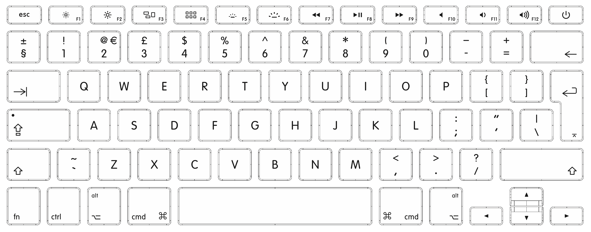

### Danish Keyboard

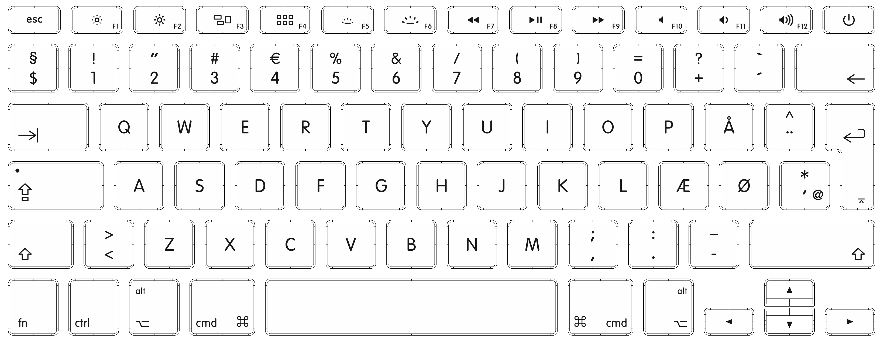

### Arabic Keyboard

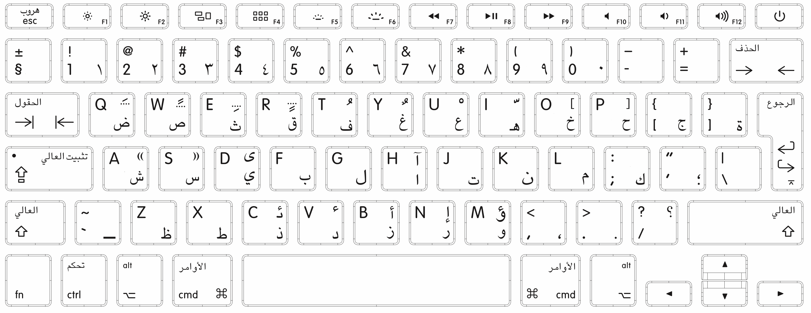

### German Keyboard

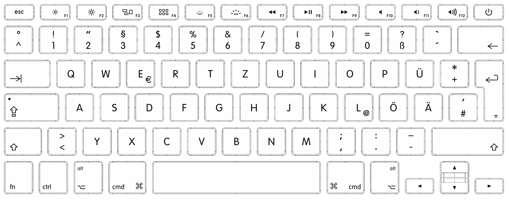

Most users swap `§` with whatever key is right next to shift `⇧ ` key. The following is sample configuration that swaps those two keys.

```json
{
    "profiles": [
        {
            "name": "Default profile",
            "selected": true,
            "simple_modifications": {
                "non_us_backslash": "grave_accent_and_tilde",
                "grave_accent_and_tilde" : "non_us_backslash"
            }
        }
    ]
}
```

This will give you following mapping:

|     Keyboard | Before | After |
|        ----- |   ---- |  ---- |
| UK or Arabic |      § |     ` |
| UK or Arabic |      ` |     § |
| UK or Arabic |      ± |     ~ |
| UK or Arabic |      ~ |     ± |
|       Danish |      § |     > |
|       Danish |      > |     § |
|       Danish |      $ |     < |
|       Danish |      < |     $ |
|       German |      ^ |     < |
|       German |      < |     ^ |
